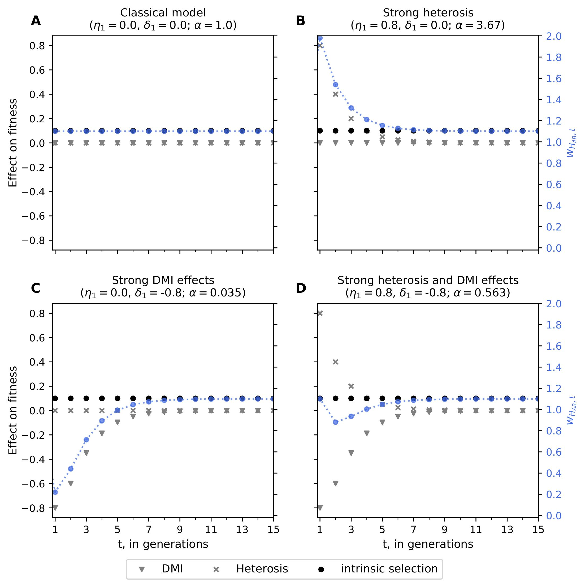
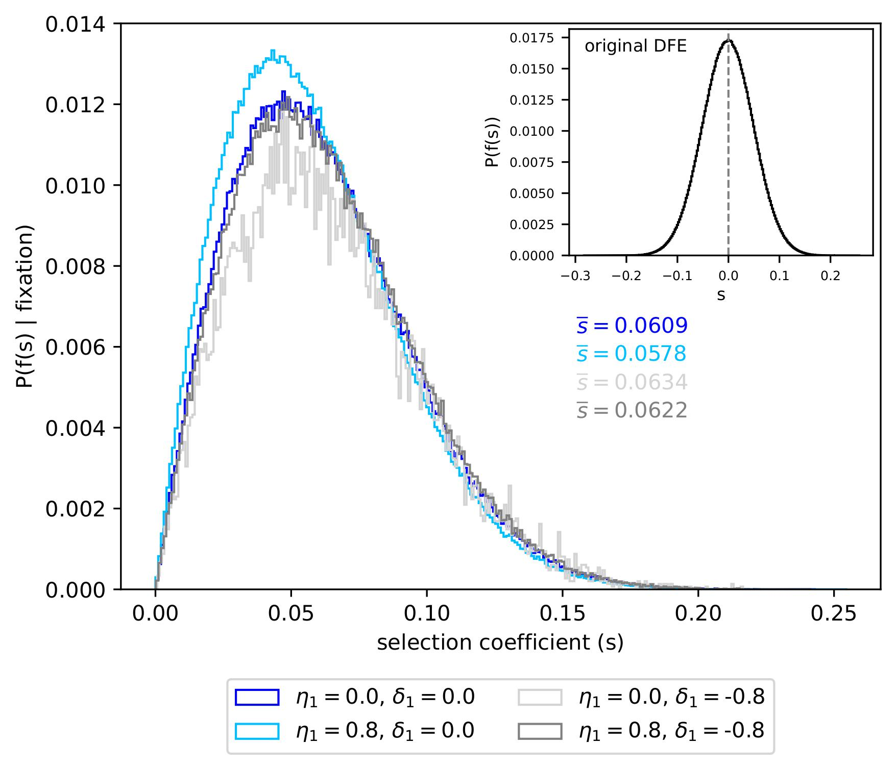

# Hybrid fitness effects modify fixation probabilities of introgressed alleles

<strong>Abstract</strong> Hybridization is a common occurrence in natural populations, and introgression is a major source of genetic variation. Despite the evolutionary importance of adaptive introgression, classical population genetics theory does not take into account hybrid fitness effects (HFEs). Specifically, heterosis (i.e., hybrid vigor) and Dobzhansky-Muller incompatibilities (DMIs) influence the fates of introgressed alleles. Here, we explicitly account for polygenic, unlinked HFEs when tracking an introgressed marker allele. These HFEs quickly decay over time due to repeated backcrossing, enabling a separation-of-timescales approach. Using branching process and diffusion theory in combination with computer simulations, we formalize the intuition behind how HFEs affect introgressed alleles. We find that HFEs can either hinder or boost the fixation probability of introgressed alleles, depending on the relative strength of heterosis effects and DMIs. We show that the inclusion of a correction factor (&alpha;, representing the compounded effects of HFEs over time) into classic population genetics theory yields accurate fixation probabilities. Despite this, HFEs only subtly change the distribution of fitness effects of introgressed alleles that reach fixation. Although strong DMI effects may expedite the loss of introgressed alleles, fixation times are largely unchanged by HFEs.

Below we provide instruction on how to reproduce the figures shown in the text.
To run the following scripts, you will need to have <em>numpy (v=1.20.2)</em>, <em>scipy (v=1.6.3)</em>, <em>matplotlib (v=3.3.4)</em>, <em>mpl-axes-aligner (v=1.1)</em>, <em>seaborn (v=0.11.1)</em>, and <em>multiprocess (v=0.70.12)</em> installed.
They can also be installed from the provided environment.yml file using conda: 

<code>conda env create -f environment.yml</code> 

This will create a new conda environment named *introgression*. Activate the environment by running: 

<code>conda activate introgression</code> 

The parameters used in the publication are set as default, and scripts can be run without specifying them.
They are specified here for illustrative purposes only. Due to stochasticity some figures may slightly differ between runs,

Figures showing the decay of unlinked HFEs were generated with Lucidshart. The documents can be accessed here: [Figure 1](https://lucid.app/documents/view/c66e34a8-0b55-408a-a391-cdae5a728b08), [Figure S5](https://lucid.app/documents/view/d6916f9b-e44c-484e-91b7-3b701a94cf7d), and [Figure S6](https://lucid.app/documents/view/3d15002b-e5d3-455b-b69a-93539d72d16b)

To reproduce Figure 2 in the paper, run the following code: 
<code>scripts/regimes.py -p 0.0 0.0 0.8 0.0 0.0 -0.8 0.8 -0.8 -s 0.1 -o ./plots/</code>

Figure 3 can be recreated by running the following code: 

<code>scripts/assess_adjusted_fixation_probability.py -N 10000 -s 0.005 0.01 0.02 0.03 0.1 -n 100000 -o ./plots/ --threads 16</code>

The script also generates Figure S1 and S2 by setting the `-c` and ``--neutral` flag, respectively.

The heatmap of the fixation probabilities for various values of &eta;1 and &delta;sd, 1 (Figure 4) can be reproduced by running: 

<code>scripts/assess_impact_on_fixation_probability.py -s 0.01 -N 10000 -n 100000 -o ./plots/</code>

The script also generates the data for Table S1 by setting the `--stochastic_dilution` flag. The stochastic dilution is modeled with a binomial distribution with number trials=genome_size / 100000000 and a success rate of 0.5. The reasoning is that we expect one recombination event per 100 Mb; hence, the genome can be divided into genome size / 100 Mb chunks. For each chunk, there are two copies, and the inclusion probability of a specific copy is 0.5. The default genome size is the size of the human genome (`--genome_size 3200000000`).

The effect on the DFE conditioned on fixation (Figure 5) can be visualized by running: 

<code>scripts/distribution_of_fitness_effects.py -N 10000 --mean_exp 0.0085 --mean_normal -0.001 --std_normal 0.05 -o -n1 10000000 -n2 100000./plots/</code>

The script also generates Figures S3 & S4 by setting the `-j` and `-b` flags.

Figure 6 is generated by executing: 

<code>scripts/analyze_sojourn_times.py -p 0.0 0.0 0.8 0.0 0.0 -0.8 0.8 -0.8 -N 10000 -s 0.01 -n 100000 -o ./plots/</code>

All other Supplementary Figures can be generated with the same commands but setting the <code>--recessive</code> or <code>--dominant</code>  flag in addition.

Alternatively, all figures can be reproduced by running <code>./reproduce_all.sh <threads=16></code>

